# HotelMaster Pro

A comprehensive C++ console application for hotel reservation management with multi-admin support and colorized interface.

## Features

- **Multi-Admin System**: Super admin and regular admin roles
- **Room Management**: Automatic room numbering (A1001, A1002, etc.)
- **Customer Registration**: With email and phone validation
- **Booking System**: Book/vacate rooms with customer tracking
- **Price Management**: Dynamic room pricing
- **Colorized Interface**: Enhanced console experience with ANSI colors
- **Secure Login**: Password masking and validation

## Screenshots

### Welcome Screen
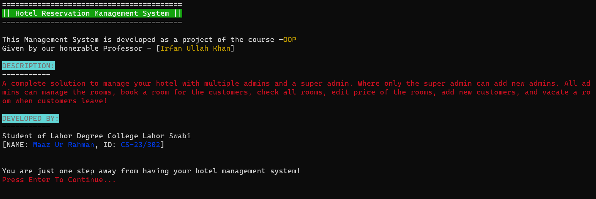
*Initial welcome screen with project information and developer details*

### Hotel Setup
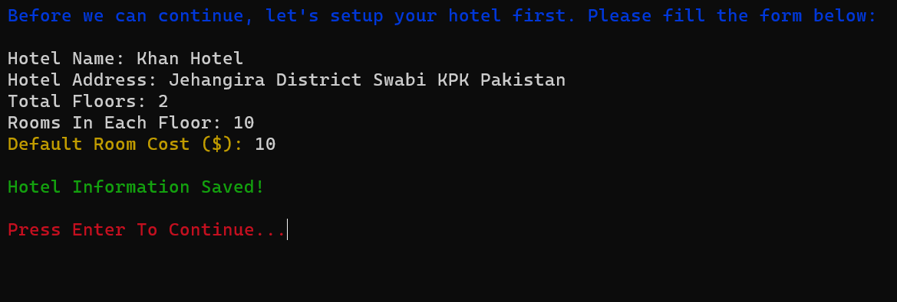
*Hotel configuration screen for setting up name, floors, rooms, and pricing*

### Super Admin Creation
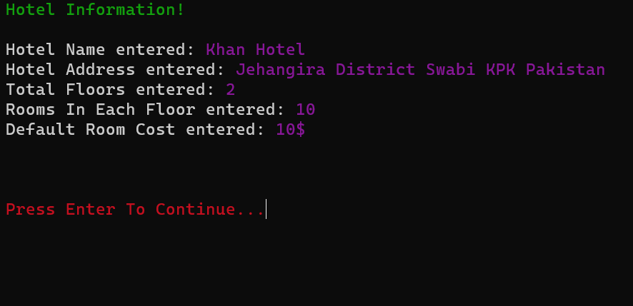
*Super admin account creation with secure password input*

### Login Screen
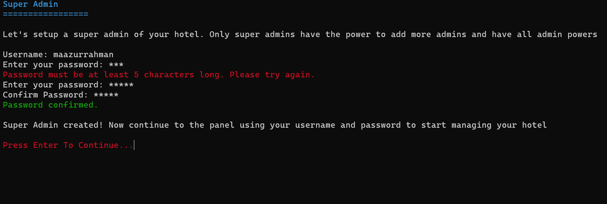
*Admin login interface with password masking*

### Admin Panel
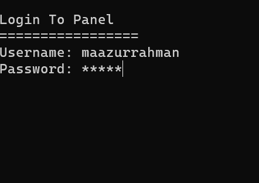
*Main admin dashboard with all management options*

### Room Management
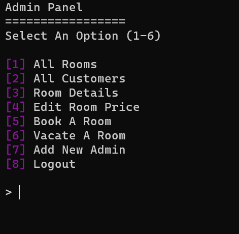
*Room status display with color-coded availability (Green=Available, Red=Booked)*

### Customer Registration
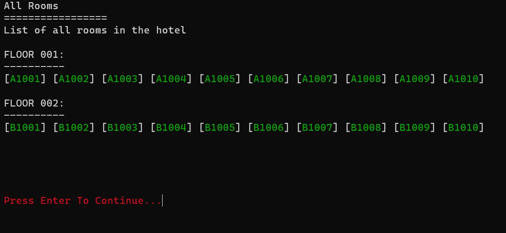
*Customer registration form with email and phone validation*

### Room Booking
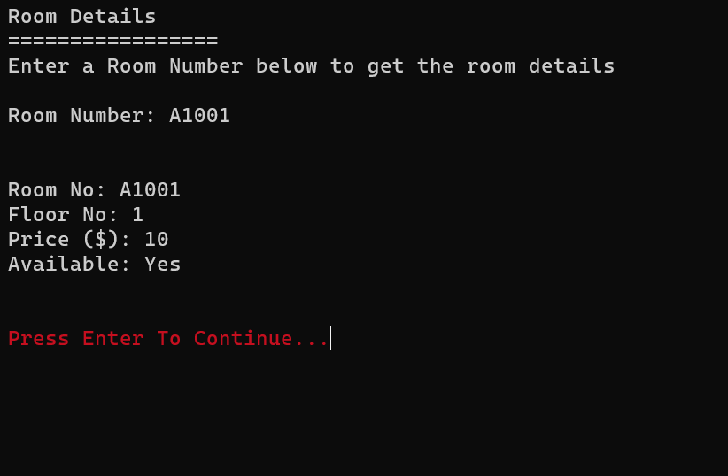
*Room booking interface with customer selection options*

### Room Details
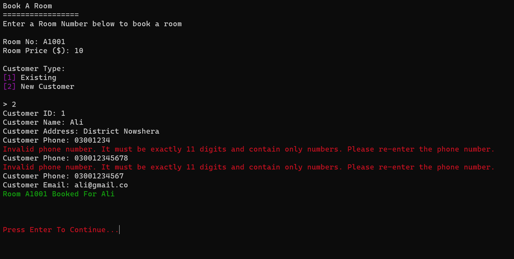
*Detailed room information and customer booking status*

### Edit Room Price
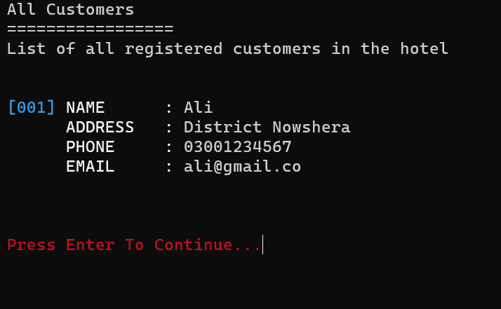
*Room price modification interface*

### Vacate Room

*Room vacancy management system*

### Add New Admin
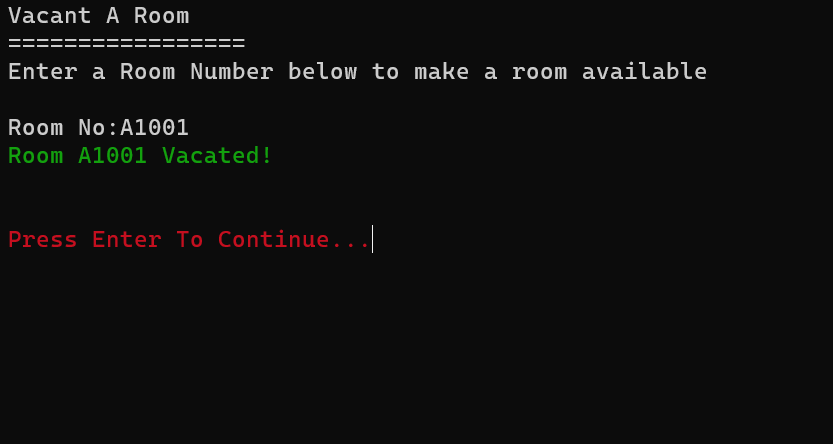
*Super admin adding new administrator accounts*

### All Customers
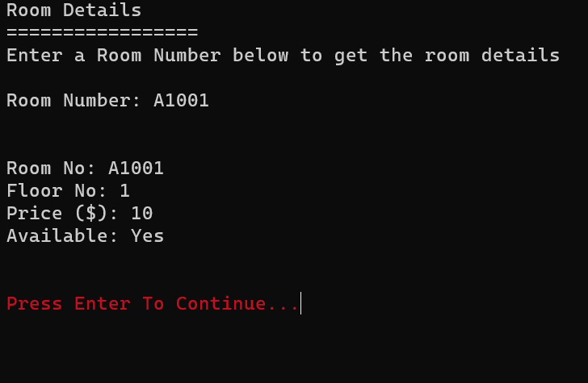
*Complete customer list with formatted display*

### Logout
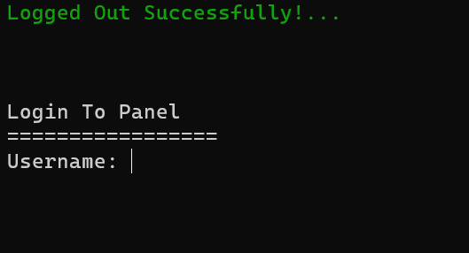
*Secure logout confirmation screen*

## Quick Start

### Prerequisites

- C++17 compatible compiler (g++, clang++)
- Windows OS (for console features)
- clang-format (optional, for code formatting)

### Build & Run

```bash
# Compile the project
g++ -std=c++17 -Iinclude src/*.cpp -o build/hotel_reservation_system.exe

# Run the application
start build\hotel_reservation_system.exe
```

### Code Formatting

```bash
# Format all source files
clang-format -i src/*.cpp include/*.h

# Check formatting of specific file
clang-format -style=file src/main.cpp
```

## Project Structure

```
HotelMaster Pro/
├── include/          # Header files
│   ├── Admin.h      # Admin management system
│   ├── Colors.h     # ANSI color definitions
│   ├── Customer.h   # Customer data management
│   ├── Hotel.h      # Hotel operations & room management
│   ├── Room.h       # Individual room functionality
│   └── Utils.h      # Utility functions & globals
├── src/             # Implementation files
│   ├── Admin.cpp    # Admin class implementation
│   ├── Customer.cpp # Customer class with validation
│   ├── Hotel.cpp    # Hotel management logic
│   ├── Room.cpp     # Room operations
│   ├── Utils.cpp    # Helper functions
│   └── main.cpp     # Application entry point
├── project-screenshots/ # Application screenshots
├── build/           # Compiled executables
├── .clang-format    # Code formatting configuration
├── .gitignore       # Version control exclusions
└── README.md        # This file
```

## Usage

1. **Initial Setup**: Configure hotel details (name, floors, rooms per floor, pricing)
2. **Super Admin Creation**: Set up the main administrator account
3. **Login**: Access the admin panel with credentials
4. **Manage Operations**:
   - View all rooms and their status
   - Register new customers
   - Book/vacate rooms
   - Edit room prices
   - Add new admins (super admin only)

## Classes Overview

### Core Classes

- **`Hotel`**: Main hotel management with room generation and booking logic
- **`Room`**: Individual room with booking status and customer tracking
- **`Customer`**: Customer data with email/phone validation
- **`Admin`**: User authentication with role-based permissions

### Key Features

- **Automatic Room Numbering**: Generates room numbers like A1001, A1002, B1001, etc.
- **Input Validation**: Email regex and 11-digit phone number validation
- **Secure Password Input**: Hidden password entry with confirmation
- **Colorized Output**: Status messages with color coding (green=success, red=error)

## Development

### Code Style

- Follows Google C++ Style Guide
- 4-space indentation
- 100-character line limit
- Consistent naming conventions

### Building from Source

```bash
# Clone or download the project
# Navigate to project directory
cd "Hotel Reservation System"

# Compile with debugging symbols
g++ -std=c++17 -g -Iinclude src/*.cpp -o build/hotel_reservation_system_debug.exe

# Or compile optimized version
g++ -std=c++17 -O2 -Iinclude src/*.cpp -o build/hotel_reservation_system.exe
```

## Author

**Maaz Ur Rahman**  
Student ID: CS-23/302  
Lahor Degree College, Lahor Swabi

_Developed as an Object-Oriented Programming (OOP) course project_

## License

This project is developed for educational purposes as part of academic coursework.
